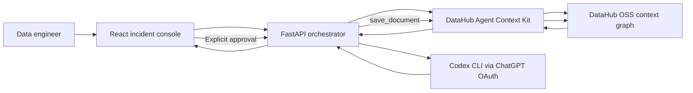

# ContextLoop

**A DataHub-powered schema-change incident agent that traces impact, assigns grounded actions, and writes approved operational memory back to the context graph.**

ContextLoop is built for the **Agents That Do Real Work** challenge in [Build with DataHub: The Agent Hackathon](https://datahub.devpost.com/). It turns a proposed column change into an auditable five-stage loop:

1. Verify the selected asset through DataHub search, then read live schema, ownership, documentation, and governance signals.
2. Query column-level downstream lineage up to three hops, build a bounded impact projection, and retrieve prior related incident memories with DataHub Agent Context Kit.
3. Use a ChatGPT-authenticated Codex runtime to classify severity and bounded risk factors.
4. Deterministically render evidence and actions assigned only to owners present in DataHub.
5. After explicit human approval, save an incident-memory document and relate it to every asset in the bounded impact set and each retrieved prior incident document.

No OpenAI API key is accepted or required. Model execution uses the user's existing **Codex ChatGPT OAuth** session, and the backend removes `OPENAI_API_KEY` from every model subprocess. This avoids metered OpenAI API billing; normal ChatGPT plan limits still apply.

## Why it matters

A schema change can look harmless at the source while silently breaking semantic models, dashboards, metrics, and replicas several hops downstream. Catalog search alone does not close that gap. ContextLoop combines DataHub's live context graph with an action-and-memory loop so the next engineer or agent inherits the evidence, decision, owners, and rollback plan.

## What is real in the demo

- DataHub OSS v1.6.0 runs locally in Docker.
- The official `showcase-ecommerce` data pack supplies schemas, owners, documentation, and lineage.
- `datahub-agent-context` performs `search`, `list_schema_fields`, `get_lineage`, `get_entities`, `search_documents`, `grep_documents`, and `save_document` operations.
- The selected `discount_amount` column on `analytics.order_details` currently resolves to 10 downstream assets across Looker, Power BI, and Snowflake.
- The backend assesses at most the first 10 returned assets. The canvas renders a source-centered star projection of up to six of them plus an overflow count; it does not reconstruct DataHub's multi-hop edge topology.
- The model call runs through `codex exec` only after `codex login status` confirms `Logged in using ChatGPT`.
- Write-back is blocked until the user clicks **Approve & write back to DataHub**.
- The resulting DataHub document is related to the source, every asset in that bounded impact set, and the retrieved prior ContextLoop incident memories.

An output captured from the verified OAuth run is available in [`examples/impact-analysis.json`](examples/impact-analysis.json), and the exact DataHub document body is in [`examples/incident-memory.md`](examples/incident-memory.md).

## Architecture



The model never receives credentials or raw warehouse data. It receives a compact, email-scrubbed projection of DataHub metadata: the requested change, exact schema match, downstream asset names and platforms, catalog owner display names, safe governance signals, and bounded excerpts from prior related ContextLoop documents. Catalog text is treated as untrusted data, never as instructions. Codex can return only a severity and a bounded list of risk-factor enums; the server derives all entity-bearing prose, counts, evidence, and owner assignments from verified DataHub context.

## Prerequisites

- macOS or Linux
- Docker Desktop, Colima, or another Docker-compatible runtime with at least 8 GB available memory
- Python 3.11 and [uv](https://docs.astral.sh/uv/)
- Node.js 22+
- [DataHub CLI](https://docs.datahub.com/docs/quickstart/)
- [Codex CLI](https://developers.openai.com/codex/cli/) signed in with ChatGPT OAuth

Verify OAuth before setup:

```bash
codex login status
```

The output must contain `Logged in using ChatGPT`.

## Quick start

```bash
git clone https://github.com/skaiea13-ai/contextloop.git
cd contextloop
./scripts/bootstrap.sh
./scripts/dev.sh
```

Open [http://127.0.0.1:5173](http://127.0.0.1:5173).

The bootstrap script:

- validates the ChatGPT OAuth session;
- starts DataHub OSS Quickstart when needed;
- configures the local DataHub CLI using Quickstart's documented local credentials;
- loads the official `showcase-ecommerce` data pack;
- installs locked Python and Node dependencies.

It does not create, request, or store an OpenAI API key.

### Free judge mode

Judges can exercise the real DataHub read, lineage, interface, approval gate, and `save_document` write-back without a Codex account or any model call:

```bash
CONTEXTLOOP_FAKE_CODEX=1 ./scripts/bootstrap.sh
CONTEXTLOOP_FAKE_CODEX=1 ./scripts/dev.sh
```

This mode is visibly labeled **Fixture · no model call**. It replaces only the reasoning response with a deterministic fixture; DataHub access and write-back remain live. The submitted demo video and release evidence use the real ChatGPT OAuth path.

## Demo flow

1. Keep the preselected `analytics.order_details` asset.
2. Choose **Drop column**, enter `discount_amount`, and keep `PROD`.
3. Click **Run impact loop**.
4. Inspect the DataHub-grounded impact projection, governance evidence, prior-memory count, business impact, and owner-bound actions.
5. Confirm that the fifth stage says **Approval required** and DataHub has not been modified.
6. Click **Approve & write back to DataHub**.
7. Follow the success link and inspect the new Analysis document in DataHub.

## OAuth-only model boundary

The implementation deliberately has no API-provider adapter. [`backend/contextloop/codex_auth.py`](backend/contextloop/codex_auth.py) enforces the boundary by:

- requiring `codex login status` to report ChatGPT OAuth;
- removing `OPENAI_API_KEY` from the child environment;
- invoking `codex exec --ephemeral --ignore-user-config --ignore-rules --sandbox read-only`;
- constraining the response to severity and bounded risk-factor enums with a strict JSON Schema;
- rejecting unexpected free-text fields and risk factors unsupported by the retrieved context;
- deriving all counts and evidence deterministically from DataHub;
- generating entity-bearing action text server-side and assigning only retrieved owners, or the explicit `Unassigned` status when none exists.

The deterministic fixture is enabled only by `CONTEXTLOOP_FAKE_CODEX=1` for free judge access, unit tests, and browser regression tests. It makes no model call and is not the product default.

## Verification

Run static and automated checks:

```bash
./scripts/verify.sh
```

Run the release gate, which includes a live OAuth analysis, explicit DataHub write-back, and exact SDK re-query verification:

```bash
./scripts/verify_live.sh
```

Release verification also includes browser QA at 1600×1000 and 390×844.

## Repository map

```text
backend/contextloop/       FastAPI, Agent Context Kit, OAuth runner
backend/tests/             OAuth-boundary and deterministic tests
frontend/src/              React incident command center
design/                    Accepted visual concept
docs/                      Architecture and Devpost-ready materials
examples/                  Verified sample outputs
scripts/                   Bootstrap, development, and verification commands
THIRD_PARTY_NOTICES.md      Direct dependency and sample-data notices
```

## Security and privacy

- Never paste a Codex, ChatGPT, DataHub, or Devpost credential into this repository.
- The local DataHub token remains in DataHub CLI's user configuration outside the repository.
- The agent receives metadata from the public sample pack, not business records.
- Owner email addresses and unsafe structured-property values are excluded from model context.
- Catalog descriptions and prior document excerpts are treated as untrusted data.
- `codex exec` is read-only and ephemeral.
- Catalog mutation is separated from model reasoning and requires an explicit UI action.

## Runtime modes

The full model-backed experience is a desktop-local demo because OAuth credentials are user-bound. It uses the operator's ChatGPT-authenticated Codex CLI and local DataHub instance. Free judge mode requires no Codex account and makes no model call, while preserving the live DataHub portions of the workflow. No shared API key or metered OpenAI API backend is used in either mode.

## Submission materials

- [Devpost description](docs/DEVPOST_DESCRIPTION.md)
- [Three-minute demo script](docs/DEMO_SCRIPT.md)
- [Official requirements checklist](docs/SUBMISSION_CHECKLIST.md)
- [Official requirements matrix](docs/REQUIREMENTS_MATRIX.md)
- [Release verification evidence](docs/RELEASE_EVIDENCE.md)
- [Architecture and threat boundaries](docs/ARCHITECTURE.md)
- [Design specification](docs/DESIGN_SPEC.md)
- [Pre-existing work and AI disclosure](docs/DISCLOSURES.md)
- [Final Devpost field pack](docs/FINAL_SUBMISSION.md)
- [Third-party notices](THIRD_PARTY_NOTICES.md)

## License

Apache License 2.0. See [`LICENSE`](LICENSE).
